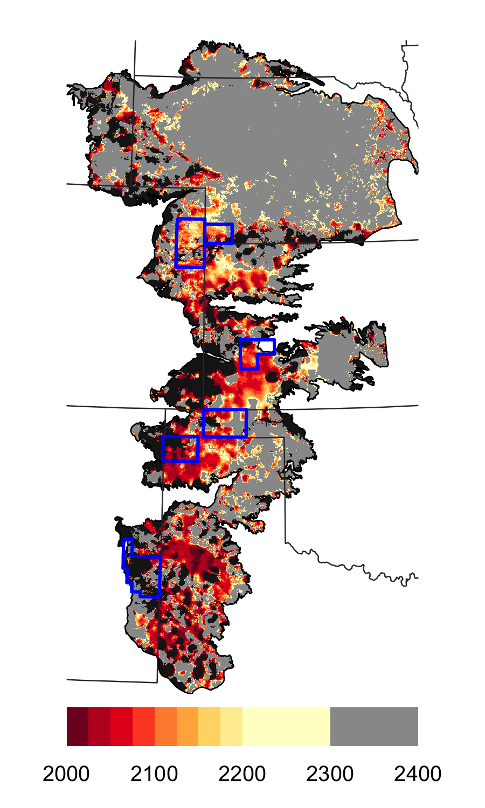
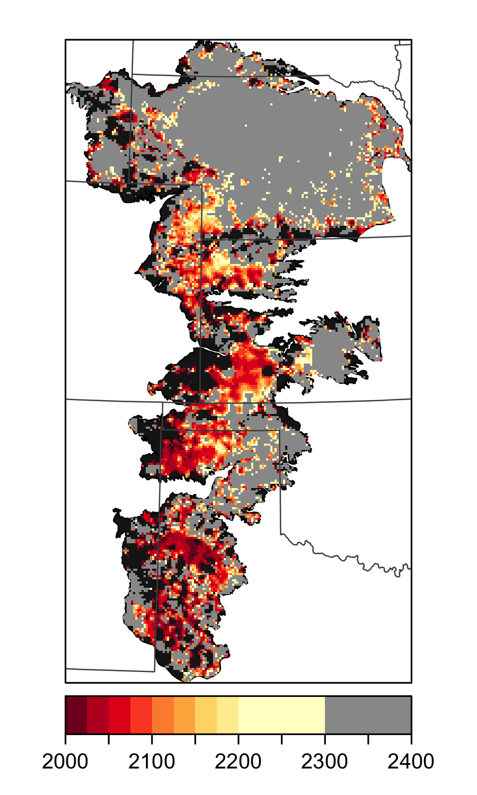
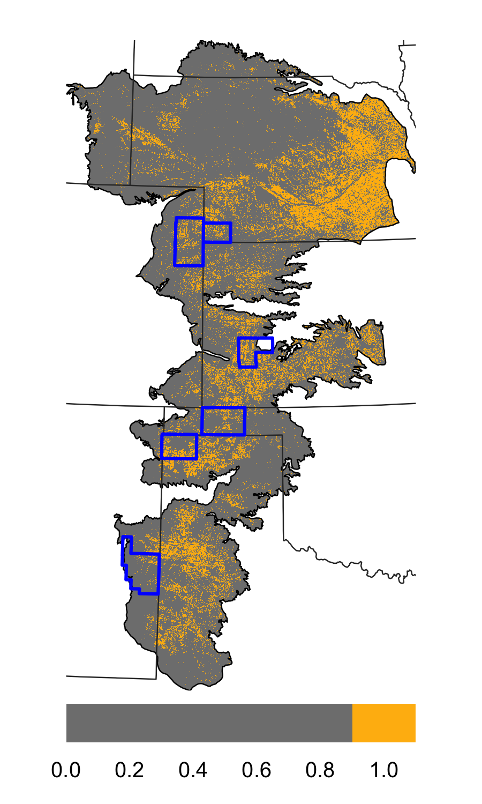
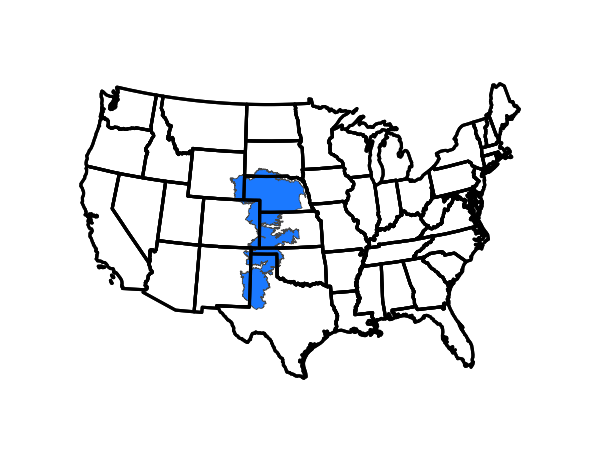

Goal: Make study area figure

Items to plot:

* groundwater depletion timeframes
* current irrigation
* county bounds


**R Packages Needed**


```r
library(tidyverse)
```

```
## Warning: package 'ggplot2' was built under R version 3.5.2
```

```
## Warning: package 'tibble' was built under R version 3.5.2
```

```
## Warning: package 'dplyr' was built under R version 3.5.2
```

```
## Warning: package 'stringr' was built under R version 3.5.2
```

```r
library(sf)
```

```
## Warning: package 'sf' was built under R version 3.5.2
```

```r
library(here)  
library(raster)

library(rgdal)
library(latticeExtra)
library(RColorBrewer)

# directories:
rootDir <- here::here() # for setting path to local repo data folder

sessionInfo()
```

```
## R version 3.5.1 (2018-07-02)
## Platform: x86_64-apple-darwin15.6.0 (64-bit)
## Running under: macOS  10.14
## 
## Matrix products: default
## BLAS: /Library/Frameworks/R.framework/Versions/3.5/Resources/lib/libRblas.0.dylib
## LAPACK: /Library/Frameworks/R.framework/Versions/3.5/Resources/lib/libRlapack.dylib
## 
## locale:
## [1] en_US.UTF-8/en_US.UTF-8/en_US.UTF-8/C/en_US.UTF-8/en_US.UTF-8
## 
## attached base packages:
## [1] stats     graphics  grDevices utils     datasets  methods   base     
## 
## other attached packages:
##  [1] latticeExtra_0.6-28 RColorBrewer_1.1-2  lattice_0.20-35    
##  [4] rgdal_1.3-4         raster_2.6-7        sp_1.3-1           
##  [7] here_0.1            sf_0.7-4            forcats_0.3.0      
## [10] stringr_1.4.0       dplyr_0.8.0.1       purrr_0.2.5        
## [13] readr_1.1.1         tidyr_0.8.1         tibble_2.0.1       
## [16] ggplot2_3.2.0       tidyverse_1.2.1     knitr_1.20         
## 
## loaded via a namespace (and not attached):
##  [1] tidyselect_0.2.5 haven_1.1.2      colorspace_1.3-2 generics_0.0.2  
##  [5] htmltools_0.3.6  yaml_2.2.0       rlang_0.3.1      e1071_1.7-0     
##  [9] pillar_1.3.1     glue_1.3.0       withr_2.1.2      DBI_1.0.0       
## [13] modelr_0.1.2     readxl_1.1.0     munsell_0.5.0    gtable_0.2.0    
## [17] cellranger_1.1.0 rvest_0.3.2      evaluate_0.11    class_7.3-14    
## [21] broom_0.5.2      Rcpp_1.0.0       scales_1.0.0     backports_1.1.2 
## [25] classInt_0.2-3   jsonlite_1.6     hms_0.4.2        digest_0.6.16   
## [29] stringi_1.2.4    grid_3.5.1       rprojroot_1.3-2  cli_1.0.1       
## [33] tools_3.5.1      magrittr_1.5     lazyeval_0.2.1   crayon_1.3.4    
## [37] pkgconfig_2.0.2  xml2_1.2.0       spData_0.2.9.3   lubridate_1.7.4 
## [41] assertthat_0.2.0 rmarkdown_1.10   httr_1.3.1       rstudioapi_0.7  
## [45] R6_2.2.2         units_0.6-1      nlme_3.1-137     compiler_3.5.1
```


# Load

## Spatial Boundaries
Reproject to the MSU CLASS project projection, which is an AEA with a modified center line so the aquifer is centered and aligned vertically


```r
# load county polygons
gisDir <- paste0(rootDir, '/data/gis/boundaries')
classProj <- '+proj=aea +lat_1=20 +lat_2=60 +lat_0=40 +lon_0=-101 +x_0=0 +y_0=0 +datum=NAD83 +units=m +no_defs +ellps=GRS80 +towgs84=0,0,0'

counties <- read_sf(paste0(gisDir,
        '/tigris_2012_counties_100_inMinBoundBuff.geojson')) %>%
  st_transform(classProj) %>%
  rename(fips5 = masterid) %>%
  dplyr::select(c(fips5))

# background polygons as spdf
states_sf <- read_sf(paste0(gisDir, '/States_continental.shp')) %>%
  st_transform(classProj) 
states <- states_sf %>%
  as_Spatial()

minBound <- read_sf(paste0(gisDir,'/HPA_MinimumBound.shp')) %>%
  st_transform(classProj) %>%
  as_Spatial()

aquifer_sf <- read_sf(paste0(gisDir,'/Aquifer_Regions_dissolve.shp')) %>%
  st_transform(classProj) %>%
  st_simplify()
aquifer <- aquifer_sf %>%
  as_Spatial()

county6 <- counties %>% 
  filter(fips5 %in% c('20055','48111','31057','08125','35041','40139')) %>%
  as_Spatial()
```

# Make maps

## Depletion

laod depletion data


```r
rasDir <- paste0(rootDir, '/data/gis/studyArea_rasters')

depletion <- raster(paste0(rasDir, '/depletion_predictions_Haacker2016.tif'))

# reproject and clip precip
depletionClass <- projectRaster(depletion, res = 1000, crs=classProj)
depletionClassCrop <- crop(depletionClass, aquifer)
depletionClassMask <- mask(depletionClassCrop, aquifer)
# set max visuzalized values between 2300-2400 class
depletionClassMask[depletionClassMask > 2390] <- 2350
```


```r
palNum <- 9
breaks <- c(2000,2025,2050,2075,2100,2125,2150,2175,2200,2300,3500)

colPal <- rev(brewer.pal(palNum, 'YlOrRd'))

depPal2 <- c(colPal,'gray60')

# no lines
spplot(depletionClassMask, col.regions = depPal2,  colorkey=list(space='bottom'),
       at = c(2000,2025,2050,2075,2100,2125,2150,2175,2200,2300,2400),
       axes = TRUE,
       maxpixels = 1000000,
       par.settings=list(axis.line=list(col=NA))) +
  latticeExtra::layer(sp.polygons(aquifer, fill = 'gray10',lwd=.8),under=T) +
  latticeExtra::layer(sp.polygons(aquifer, lwd=.8))  +
  latticeExtra::layer(sp.polygons(states, lwd=.8, col='gray20')) +
  latticeExtra::layer(sp.polygons(county6, lwd = 2, col = 'blue'))
```

<!-- -->

```r
# for color key with outlines
spplot(depletionClassMask, col.regions = depPal2,  colorkey=list(space='bottom'),
       at = c(2000,2025,2050,2075,2100,2125,2150,2175,2200,2300,2400),
       axes = TRUE) +
  latticeExtra::layer(sp.polygons(aquifer, fill = 'gray10',lwd=.8),under=T)   +
  latticeExtra::layer(sp.polygons(states, lwd=.8, col='gray30')) 
```

<!-- -->

## Irrigation: Current

load irrigated area


```r
irrigation <- raster(paste0(rasDir,
               '/2015-2017_AIM-HPA_finalMaps_currentIrrigation.tif'))

irrClass <- projectRaster(irrigation, res = 450, crs=classProj)
irrClassCrop <- crop(irrClass, aquifer)
irrClassMask <- mask(irrClassCrop, aquifer)
```


```r
# no lines
spplot(irrClassMask, col.regions = c('gray50','darkgoldenrod1'), 
       at = c(0,.9,1.1),
       colorkey=list(space='bottom'),
       maxpixels = 1000000,
       par.settings=list(axis.line=list(col=NA))) +
  #latticeExtra::layer(sp.polygons(aquifer, fill = 'gray10',lwd=.8),under=T) +
  latticeExtra::layer(sp.polygons(aquifer, lwd=.8))  +
  latticeExtra::layer(sp.polygons(states, lwd=.8, col='gray20')) +
  latticeExtra::layer(sp.polygons(county6, lwd = 2, col = 'blue'))
```

<!-- -->

# inset


```r
plot(states_sf[1], col = NA, reset = FALSE, main = NA)
#plot(minBound_sf, col = 'lightblue', add = TRUE, border = 'lightblue')
plot(aquifer_sf, col = 'dodgerblue1', add = TRUE, lwd = 0.25, border = 'gray35')
```

```
## Warning in plot.sf(aquifer_sf, col = "dodgerblue1", add = TRUE, lwd =
## 0.25, : ignoring all but the first attribute
```

```r
plot(states_sf[1], col = NA, add = TRUE)
```

<!-- -->

