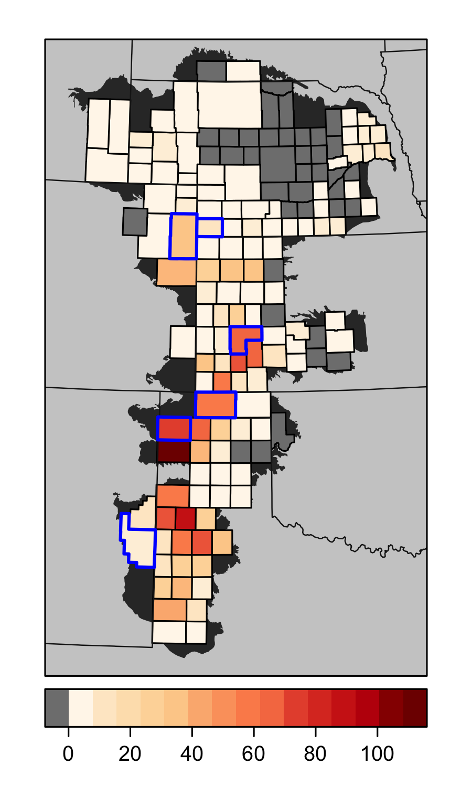
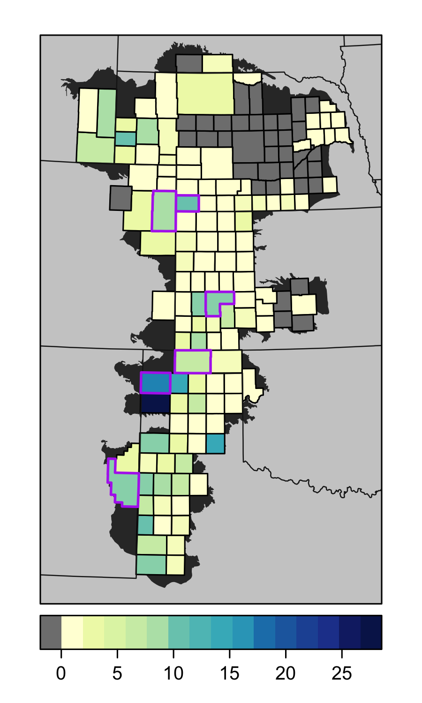

Goal: Make figure showing results by county

Items to plot:

* total irrigated acres lost by 2100
* percent of lost acres going to pasture


**R Packages Needed**


```r
library(tidyverse)
```

```
## Warning: package 'ggplot2' was built under R version 3.5.2
```

```
## Warning: package 'tibble' was built under R version 3.5.2
```

```
## Warning: package 'dplyr' was built under R version 3.5.2
```

```
## Warning: package 'stringr' was built under R version 3.5.2
```

```r
library(sf)
```

```
## Warning: package 'sf' was built under R version 3.5.2
```

```r
library(here)  

library(rgdal)
library(latticeExtra)
library(RColorBrewer)

# directories:
rootDir <- here::here() # for setting path to local repo data folder

# formatted data master file (in data/tabular)
masterFilename <- 'counties_allAquiferContained_Irr_currentRecent_rserev1_annualIrrLoss_rsSuit_acres_billFormated_allCounties_master.csv'

sessionInfo()
```

```
## R version 3.5.1 (2018-07-02)
## Platform: x86_64-apple-darwin15.6.0 (64-bit)
## Running under: macOS  10.14
## 
## Matrix products: default
## BLAS: /Library/Frameworks/R.framework/Versions/3.5/Resources/lib/libRblas.0.dylib
## LAPACK: /Library/Frameworks/R.framework/Versions/3.5/Resources/lib/libRlapack.dylib
## 
## locale:
## [1] en_US.UTF-8/en_US.UTF-8/en_US.UTF-8/C/en_US.UTF-8/en_US.UTF-8
## 
## attached base packages:
## [1] stats     graphics  grDevices utils     datasets  methods   base     
## 
## other attached packages:
##  [1] latticeExtra_0.6-28 RColorBrewer_1.1-2  lattice_0.20-35    
##  [4] rgdal_1.3-4         sp_1.3-1            here_0.1           
##  [7] sf_0.7-4            forcats_0.3.0       stringr_1.4.0      
## [10] dplyr_0.8.0.1       purrr_0.2.5         readr_1.1.1        
## [13] tidyr_0.8.1         tibble_2.0.1        ggplot2_3.2.0      
## [16] tidyverse_1.2.1     knitr_1.20         
## 
## loaded via a namespace (and not attached):
##  [1] tidyselect_0.2.5 haven_1.1.2      colorspace_1.3-2 generics_0.0.2  
##  [5] htmltools_0.3.6  yaml_2.2.0       rlang_0.3.1      e1071_1.7-0     
##  [9] pillar_1.3.1     glue_1.3.0       withr_2.1.2      DBI_1.0.0       
## [13] modelr_0.1.2     readxl_1.1.0     munsell_0.5.0    gtable_0.2.0    
## [17] cellranger_1.1.0 rvest_0.3.2      evaluate_0.11    class_7.3-14    
## [21] broom_0.5.2      Rcpp_1.0.0       scales_1.0.0     backports_1.1.2 
## [25] classInt_0.2-3   jsonlite_1.6     hms_0.4.2        digest_0.6.16   
## [29] stringi_1.2.4    grid_3.5.1       rprojroot_1.3-2  cli_1.0.1       
## [33] tools_3.5.1      magrittr_1.5     lazyeval_0.2.1   crayon_1.3.4    
## [37] pkgconfig_2.0.2  xml2_1.2.0       spData_0.2.9.3   lubridate_1.7.4 
## [41] assertthat_0.2.0 rmarkdown_1.10   httr_1.3.1       rstudioapi_0.7  
## [45] R6_2.2.2         units_0.6-1      nlme_3.1-137     compiler_3.5.1
```


# Load

## Spatial Boundaries
Reproject to the MSU CLASS project projection, which is an AEA with a modified center line so the aquifer is centered and aligned vertically


```r
# load county polygons
gisDir <- paste0(rootDir, '/data/gis/boundaries')
classProj <- '+proj=aea +lat_1=20 +lat_2=60 +lat_0=40 +lon_0=-101 +x_0=0 +y_0=0 +datum=NAD83 +units=m +no_defs +ellps=GRS80 +towgs84=0,0,0'

counties <- read_sf(paste0(gisDir,
        '/tigris_2012_counties_100_inMinBoundBuff.geojson')) %>%
  st_transform(classProj) %>%
  rename(fips5 = masterid) %>%
  dplyr::select(c(fips5))

county6 <- counties %>% 
  filter(fips5 %in% c('20055','48111','31057','08125','35041','40139')) %>%
  as_Spatial()

# bakcground polygons as spdf
states <- read_sf(paste0(gisDir, '/States_continental.shp')) %>%
  st_transform(classProj) %>%
  as_Spatial()

minBound <- read_sf(paste0(gisDir,'/HPA_MinimumBound.shp')) %>%
  st_transform(classProj) %>%
  as_Spatial()

aquifer <- read_sf(paste0(gisDir,'/Aquifer_Regions_dissolve.shp')) %>%
  st_transform(classProj) %>%
  st_simplify() %>%
  as_Spatial()
```

## Datasets
this was in acres for bill, so convert to ha


```r
master0 <- read_csv(paste0(rootDir, '/data/tabular/', masterFilename))
```

```
## Parsed with column specification:
## cols(
##   StateAbbrev = col_character(),
##   fips5 = col_character(),
##   year = col_integer(),
##   drylandAg = col_double(),
##   pasture = col_double(),
##   active = col_double(),
##   lossDrylandAg = col_double(),
##   lossPasture = col_double(),
##   currentIrr_20152017_acres = col_double(),
##   totalLostDrylandAg = col_double(),
##   totalLostPasture = col_double(),
##   percentLost_drylandAg = col_double(),
##   percentLost_pasture = col_double()
## )
```

```r
# extract values of interest
master <- master0 %>%
  filter(year == 2100) %>%
  mutate(irrAreaLost_ha = (totalLostDrylandAg + totalLostPasture) /  2.471,
           percentLost_pasture = percentLost_pasture*100,
         percentLost_pasture2 = (totalLostPasture/(totalLostDrylandAg + totalLostPasture) )*100) %>%
  dplyr::select(fips5, currentIrr_20152017_acres, active, irrAreaLost_ha, totalLostDrylandAg, totalLostPasture, percentLost_pasture, percentLost_pasture2)

# spatialize county numbers and fix county sf object for spdf conversion
countyData <- counties %>%
  left_join(master, by = 'fips5') %>%
  mutate(irrAreaLost_1000ha = irrAreaLost_ha / 1000)

# set NA values to 0
countyData[is.na(countyData$irrAreaLost_1000ha),'irrAreaLost_1000ha'] <- 0
countyData[is.na(countyData$percentLost_pasture),'percentLost_pasture'] <- 0


types <- vapply(st_geometry(countyData), function(x) {
  class(x)[2]
}, '')
countyData2 <- countyData[grepl('*POLYGON', types),]

bad <-  countyData[!grepl('*POLYGON', types),]
test <- st_collection_extract(bad, "POLYGON")

countyData3 <- rbind(countyData2, test)

countySp <- as(countyData3, 'Spatial')
```


# Make maps

## vis parameters


```r
panelBackground <- 'gray5'
stateLines <- 'gray10'
stateFill <- 'gray80'
aquiferFill <- 'gray20'
aimFill <- 'gray50'
mapXLim <- c(-430000,440000)
mapYLim <- c(-1000000,450000)

irrLossPalette <- brewer.pal(n = 9, name = 'OrRd')
irrLossRamp <- colorRampPalette(irrLossPalette)

pasturePal2 <- brewer.pal(n=9, name = 'YlGnBu')
pasturePal2Ramp <- colorRampPalette(pasturePal2)

pasturePal3 <- brewer.pal(n=9, name = 'GnBu')
pasturePal3Ramp <- colorRampPalette(pasturePal3)
```

## Irrigated Area Loss by County (2100)


```r
spplot(countySp, 'irrAreaLost_1000ha', col.regions = c('gray50',irrLossRamp(19)),
       xlim = mapXLim, ylim = mapYLim,
       colorkey = list(space = 'bottom'),
       par.settings = list(panel.background = list(col=panelBackground))) +
  latticeExtra::layer(sp.polygons(states, lwd=.8, col=stateLines)) +
  latticeExtra::layer(sp.polygons(aquifer, lwd=.8, col=NA, fill = aquiferFill), under=T) +
   # latticeExtra::layer(sp.polygons(minBound, lwd=.8, col=NA, fill = aimFill), under=T) +
  latticeExtra::layer(sp.polygons(states, lwd=.8, col=NA, fill = stateFill), under = TRUE) +
  latticeExtra::layer(sp.polygons(county6, lwd = 2, col = 'blue'))
```

<!-- -->

## Proportion Pasture


```r
spplot(countySp, 'percentLost_pasture', 
       col.regions = c('gray50',pasturePal2Ramp(19)),
       xlim = mapXLim, ylim = mapYLim,
       colorkey = list(space = 'bottom'),
       par.settings = list(panel.background = list(col=panelBackground))) +
  latticeExtra::layer(sp.polygons(states, lwd=.8, col=stateLines)) +
  latticeExtra::layer(sp.polygons(aquifer, lwd=.8, col=NA, fill = aquiferFill), under=T) +
   # latticeExtra::layer(sp.polygons(minBound, lwd=.8, col=NA, fill = aimFill), under=T) +
  latticeExtra::layer(sp.polygons(states, lwd=.8, col=NA, fill = stateFill), under = TRUE)  +
  latticeExtra::layer(sp.polygons(county6, lwd = 1.75, col = 'darkorchid2'))
```

<!-- -->

