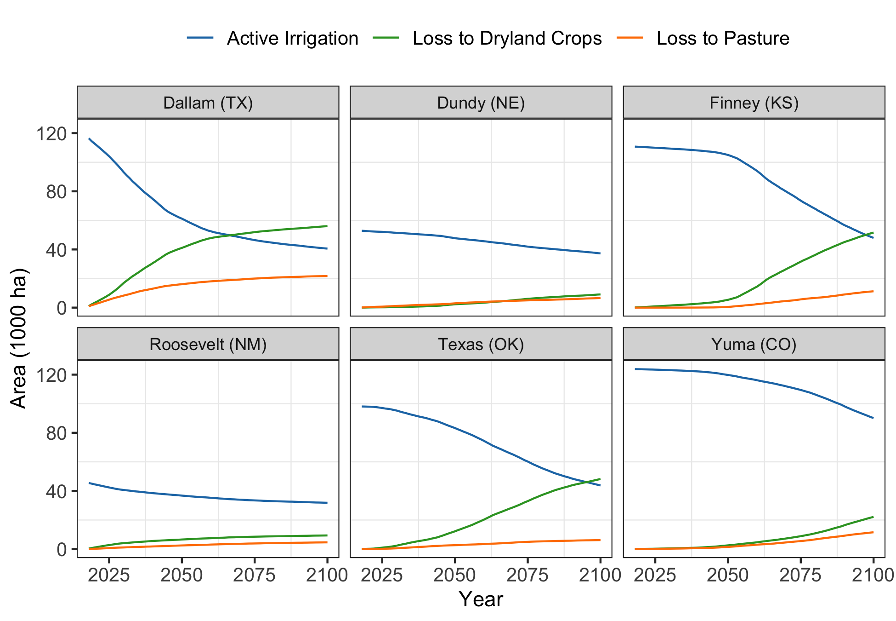

Goal: Make figures showing irrigation transition trends for 6 selected counties


**R Packages Needed**


```r
library(tidyverse)
```

```
## Warning: package 'ggplot2' was built under R version 3.5.2
```

```
## Warning: package 'tibble' was built under R version 3.5.2
```

```
## Warning: package 'dplyr' was built under R version 3.5.2
```

```
## Warning: package 'stringr' was built under R version 3.5.2
```

```r
library(cowplot)

# directories: cleaned data from 00.23
library(here)
rootDir <- here::here()
subfolder <- 'data/tabular'
filename <- 'counties_allAquiferContained_Irr_currentRecent_rserev1_annualIrrLoss_rsSuit_acres_billFormated_selectedCounties.csv'

sessionInfo()
```

```
## R version 3.5.1 (2018-07-02)
## Platform: x86_64-apple-darwin15.6.0 (64-bit)
## Running under: macOS  10.14
## 
## Matrix products: default
## BLAS: /Library/Frameworks/R.framework/Versions/3.5/Resources/lib/libRblas.0.dylib
## LAPACK: /Library/Frameworks/R.framework/Versions/3.5/Resources/lib/libRlapack.dylib
## 
## locale:
## [1] en_US.UTF-8/en_US.UTF-8/en_US.UTF-8/C/en_US.UTF-8/en_US.UTF-8
## 
## attached base packages:
## [1] stats     graphics  grDevices utils     datasets  methods   base     
## 
## other attached packages:
##  [1] here_0.1        cowplot_0.9.3   forcats_0.3.0   stringr_1.4.0  
##  [5] dplyr_0.8.0.1   purrr_0.2.5     readr_1.1.1     tidyr_0.8.1    
##  [9] tibble_2.0.1    ggplot2_3.2.0   tidyverse_1.2.1 knitr_1.20     
## 
## loaded via a namespace (and not attached):
##  [1] Rcpp_1.0.0       cellranger_1.1.0 pillar_1.3.1     compiler_3.5.1  
##  [5] tools_3.5.1      digest_0.6.16    lubridate_1.7.4  jsonlite_1.6    
##  [9] evaluate_0.11    nlme_3.1-137     gtable_0.2.0     lattice_0.20-35 
## [13] pkgconfig_2.0.2  rlang_0.3.1      cli_1.0.1        rstudioapi_0.7  
## [17] yaml_2.2.0       haven_1.1.2      withr_2.1.2      xml2_1.2.0      
## [21] httr_1.3.1       generics_0.0.2   hms_0.4.2        rprojroot_1.3-2 
## [25] grid_3.5.1       tidyselect_0.2.5 glue_1.3.0       R6_2.2.2        
## [29] readxl_1.1.0     rmarkdown_1.10   modelr_0.1.2     magrittr_1.5    
## [33] backports_1.1.2  scales_1.0.0     htmltools_0.3.6  rvest_0.3.2     
## [37] assertthat_0.2.0 colorspace_1.3-2 stringi_1.2.4    lazyeval_0.2.1  
## [41] munsell_0.5.0    broom_0.5.2      crayon_1.3.4
```


# Load


```r
# formatted data
projections <- read_csv(paste0(rootDir, '/', subfolder, '/', filename))
```

```
## Parsed with column specification:
## cols(
##   StateAbbrev = col_character(),
##   fips5 = col_character(),
##   year = col_integer(),
##   drylandAg = col_double(),
##   pasture = col_double(),
##   activeIrr_acres = col_double(),
##   cumLoss_drylandAg_acres = col_double(),
##   cumLoss_pasture_acres = col_double()
## )
```

```r
# var name recoders
countyNames <- data.frame(fips5 = c('20055', '31057', '48111', '08125',
                                                 '35041', '40139'),
                          countyName = c('Finney (KS)', 'Dundy (NE)','Dallam (TX)',
                                         'Yuma (CO)', 'Roosevelt (NM)', 'Texas (OK)'))
categories <- data.frame(var2 = c('activeIrr','cumLoss_drylandAg','cumLoss_pasture'),
                         varType = c('Active Irrigation','Loss to Dryland Crops',
                                     'Loss to Pasture'))
# max irr area
irrMax <- projections %>%
  group_by(fips5) %>%
  summarize(maxIrr_ha = max(activeIrr_acres) * 0.404686)

# convert cumulative columns to hectares/long format
projLong <- projections %>%
  dplyr::select(-c(drylandAg, pasture)) %>%
  tidyr::gather(., key = variable, value = value, activeIrr_acres:cumLoss_pasture_acres) %>%
  mutate(value_ha = value * 0.404686,
         var2 = str_remove(variable, '_acres')) %>%
  left_join(irrMax) %>%
  mutate(value_percent = value_ha/maxIrr_ha) %>%
  dplyr::select(-c(variable, value))  %>%
  left_join(countyNames) %>%
  left_join(categories)
```

```
## Joining, by = "fips5"
```

```
## Joining, by = "fips5"
```

```
## Warning: Column `fips5` joining character vector and factor, coercing into
## character vector
```

```
## Joining, by = "var2"
```

```
## Warning: Column `var2` joining character vector and factor, coercing into
## character vector
```

Numbers for Cait


```r
# starting and ending numbers
summaries <- projections %>%
  left_join(countyNames) %>%
  group_by(countyName) %>%
  summarize(startingIrr_ha = max(activeIrr_acres) * 0.404686,
            endingIrr_ha = min(activeIrr_acres) * 0.404686,
            endingDryland_ha = max(cumLoss_drylandAg_acres) * 0.404686,
            endingPasture_ha = max(cumLoss_pasture_acres) * 0.404686)
```

```
## Joining, by = "fips5"
```

```
## Warning: Column `fips5` joining character vector and factor, coercing into
## character vector
```

```r
kable(summaries)
```


countyName        startingIrr_ha   endingIrr_ha   endingDryland_ha   endingPasture_ha
---------------  ---------------  -------------  -----------------  -----------------
Dallam (TX)            116448.81       40589.45          56041.297          21720.049
Dundy (NE)              52866.67       37285.45           9069.582           6635.397
Finney (KS)            110750.76       47965.65          51631.851          11245.116
Roosevelt (NM)          45460.68       31855.36           9390.874           4633.220
Texas (OK)              98094.98       43775.15          48205.500           6203.962
Yuma (CO)              123817.44       90143.16          22142.951          11568.570

```r
# differences (absolute and percentaages)
diffs <- summaries %>%
  mutate(abs_diff_ha = startingIrr_ha - endingIrr_ha,
         perc_diff_ha = (startingIrr_ha - endingIrr_ha)/startingIrr_ha * 100,
         percentPasture = endingPasture_ha/(endingDryland_ha + endingPasture_ha) * 100,
         percentStarting = endingPasture_ha/startingIrr_ha*100) %>%
  dplyr::select(-c(startingIrr_ha, endingIrr_ha)) 
kable(diffs)
```


countyName        endingDryland_ha   endingPasture_ha   abs_diff_ha   perc_diff_ha   percentPasture   percentStarting
---------------  -----------------  -----------------  ------------  -------------  ---------------  ----------------
Dallam (TX)              56041.297          21720.049      75859.36       65.14395         27.93168         18.652014
Dundy (NE)                9069.582           6635.397      15581.23       29.47268         42.25028         12.551191
Finney (KS)              51631.851          11245.116      62785.11       56.69045         17.88432         10.153534
Roosevelt (NM)            9390.874           4633.220      13605.32       29.92767         33.03757         10.191709
Texas (OK)               48205.500           6203.962      54319.84       55.37473         11.40236          6.324444
Yuma (CO)                22142.951          11568.570      33674.28       27.19672         34.31637          9.343247

```r
diffs %>% arrange(perc_diff_ha)
```

```
## # A tibble: 6 x 7
##   countyName endingDryland_ha endingPasture_ha abs_diff_ha perc_diff_ha
##   <fct>                 <dbl>            <dbl>       <dbl>        <dbl>
## 1 Yuma (CO)            22143.           11569.      33674.         27.2
## 2 Dundy (NE)            9070.            6635.      15581.         29.5
## 3 Roosevelt…            9391.            4633.      13605.         29.9
## 4 Texas (OK)           48206.            6204.      54320.         55.4
## 5 Finney (K…           51632.           11245.      62785.         56.7
## 6 Dallam (T…           56041.           21720.      75859.         65.1
## # … with 2 more variables: percentPasture <dbl>, percentStarting <dbl>
```

```r
diffs %>% arrange(percentPasture)
```

```
## # A tibble: 6 x 7
##   countyName endingDryland_ha endingPasture_ha abs_diff_ha perc_diff_ha
##   <fct>                 <dbl>            <dbl>       <dbl>        <dbl>
## 1 Texas (OK)           48206.            6204.      54320.         55.4
## 2 Finney (K…           51632.           11245.      62785.         56.7
## 3 Dallam (T…           56041.           21720.      75859.         65.1
## 4 Roosevelt…            9391.            4633.      13605.         29.9
## 5 Yuma (CO)            22143.           11569.      33674.         27.2
## 6 Dundy (NE)            9070.            6635.      15581.         29.5
## # … with 2 more variables: percentPasture <dbl>, percentStarting <dbl>
```

```r
diffs %>% arrange(endingPasture_ha)
```

```
## # A tibble: 6 x 7
##   countyName endingDryland_ha endingPasture_ha abs_diff_ha perc_diff_ha
##   <fct>                 <dbl>            <dbl>       <dbl>        <dbl>
## 1 Roosevelt…            9391.            4633.      13605.         29.9
## 2 Texas (OK)           48206.            6204.      54320.         55.4
## 3 Dundy (NE)            9070.            6635.      15581.         29.5
## 4 Finney (K…           51632.           11245.      62785.         56.7
## 5 Yuma (CO)            22143.           11569.      33674.         27.2
## 6 Dallam (T…           56041.           21720.      75859.         65.1
## # … with 2 more variables: percentPasture <dbl>, percentStarting <dbl>
```


# 6 County Multipanel

## absolute area


```r
ggplot(projLong,
       aes(x = year, y = value_ha/1000, color = varType, group = varType)) +
  geom_line() +
  facet_wrap(~countyName) +
  scale_x_continuous(breaks = c(2025, 2050, 2075, 2100)) +
  scale_color_manual(values = c('#1f78b4', '#33a02c', '#ff7f00')) +
  ylab('Area (1000 ha)') + xlab('Year') +
  theme_bw() + theme(legend.position = 'top',
                     legend.title = element_blank(),
                     axis.text=element_text(size=10),
                     legend.text=element_text(size=10),
                     axis.title=element_text(size=11),
                     #panel.grid.minor = element_blank(),
                     panel.grid.major = element_blank())
```

<!-- -->


# Economic impact summaries


```r
cropRevs <- c(626.52,572.95,797.86,195.29,624.14,660.79)
mean(cropRevs)
```

```
## [1] 579.5917
```

```r
pastureRevs <- c(51.44,54.29,51.44,53.31,54.29,57.49)
mean(pastureRevs)
```

```
## [1] 53.71
```

```r
mean(cropRevs)/mean(pastureRevs)
```

```
## [1] 10.79113
```

```r
#county differences
countyFactor0 <- data.frame(crop = cropRevs,
                           pasture = pastureRevs)
countyFactor <- countyFactor0 %>%
  mutate(factor = crop/pasture)
countyFactor
```

```
##     crop pasture   factor
## 1 626.52   51.44 12.17963
## 2 572.95   54.29 10.55351
## 3 797.86   51.44 15.51050
## 4 195.29   53.31  3.66329
## 5 624.14   54.29 11.49641
## 6 660.79   57.49 11.49400
```

```r
# gross tallies
grossRevs1 <- c(547564295, 1086610526, 488820290,154946109,1279628015,3031785080)
grossRevs2 <- c(362517099,935337299,268002433,121659738,1123041191,2243459122)

gross0 <- data.frame(scenario1 = grossRevs1,
                    scenario2 = grossRevs2)
gross <- gross0 %>%
  mutate(diff_abs = scenario1 - scenario2,
         diff_perc = (scenario1 - scenario2)/scenario1*100)
gross
```

```
##    scenario1  scenario2  diff_abs diff_perc
## 1  547564295  362517099 185047196  33.79461
## 2 1086610526  935337299 151273227  13.92157
## 3  488820290  268002433 220817857  45.17363
## 4  154946109  121659738  33286371  21.48255
## 5 1279628015 1123041191 156586824  12.23690
## 6 3031785080 2243459122 788325958  26.00204
```

```r
gross %>%
  summarize(scen1_sum = sum(scenario1),
            scen2_sum = sum(scenario2)) %>%
  mutate(diff_abs = scen1_sum - scen2_sum,
         diff_perc = (scen1_sum - scen2_sum)/scen1_sum*100)
```

```
##    scen1_sum  scen2_sum   diff_abs diff_perc
## 1 6589354315 5054016882 1535337433  23.30027
```

```r
# value added tallies
valu1 <- c(317587291,619368000,268851159,99165510,716591688,1758435347)
value2 <- c(210277317,532667200,147857833,76737528,628007929,1297450427)

valu0 <- data.frame(scenario1 = valu1,
                    scenario2 = value2)
valu <- valu0 %>%
  mutate(diff_abs = scenario1 - scenario2,
         diff_perc = (scenario1 - scenario2)/scenario1*100)
valu
```

```
##    scenario1  scenario2  diff_abs diff_perc
## 1  317587291  210277317 107309974  33.78913
## 2  619368000  532667200  86700800  13.99827
## 3  268851159  147857833 120993326  45.00383
## 4   99165510   76737528  22427982  22.61672
## 5  716591688  628007929  88583759  12.36182
## 6 1758435347 1297450427 460984920  26.21563
```

```r
valu %>%
  summarize(scen1_sum = sum(scenario1),
            scen2_sum = sum(scenario2)) %>%
  mutate(diff_abs = scen1_sum - scen2_sum,
         diff_perc = (scen1_sum - scen2_sum)/scen1_sum*100)
```

```
##    scen1_sum  scen2_sum  diff_abs diff_perc
## 1 3779998995 2892998234 887000761  23.46563
```

