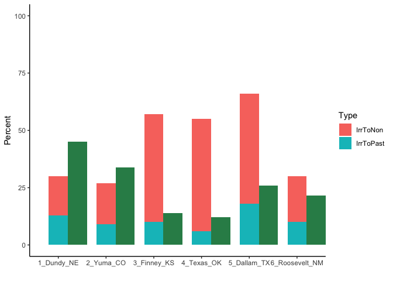

Goal: Make summary figure for land use transitions and economic implications

note: code by Cait Rottler


**R Packages Needed**


```r
library(dplyr)
```

```
## Warning: package 'dplyr' was built under R version 3.5.2
```

```r
library(plotly)
```

```
## Warning: package 'ggplot2' was built under R version 3.5.2
```

```r
library(ggplot2)
library(svglite)


# directories: cleaned data from 00.23
library(here)
rootDir <- here::here()
subfolder <- 'data/tabular'
filename <- 'summaryNumbers_forFigure4_Cait.csv'

sessionInfo()
```

```
## R version 3.5.1 (2018-07-02)
## Platform: x86_64-apple-darwin15.6.0 (64-bit)
## Running under: macOS  10.14
## 
## Matrix products: default
## BLAS: /Library/Frameworks/R.framework/Versions/3.5/Resources/lib/libRblas.0.dylib
## LAPACK: /Library/Frameworks/R.framework/Versions/3.5/Resources/lib/libRlapack.dylib
## 
## locale:
## [1] en_US.UTF-8/en_US.UTF-8/en_US.UTF-8/C/en_US.UTF-8/en_US.UTF-8
## 
## attached base packages:
## [1] stats     graphics  grDevices utils     datasets  methods   base     
## 
## other attached packages:
## [1] here_0.1      svglite_1.2.1 plotly_4.9.0  ggplot2_3.2.0 dplyr_0.8.0.1
## [6] knitr_1.20   
## 
## loaded via a namespace (and not attached):
##  [1] Rcpp_1.0.0        pillar_1.3.1      compiler_3.5.1   
##  [4] tools_3.5.1       digest_0.6.16     jsonlite_1.6     
##  [7] evaluate_0.11     tibble_2.0.1      gtable_0.2.0     
## [10] viridisLite_0.3.0 pkgconfig_2.0.2   rlang_0.3.1      
## [13] yaml_2.2.0        withr_2.1.2       stringr_1.4.0    
## [16] httr_1.3.1        gdtools_0.1.7     htmlwidgets_1.3  
## [19] rprojroot_1.3-2   grid_3.5.1        tidyselect_0.2.5 
## [22] glue_1.3.0        data.table_1.11.4 R6_2.2.2         
## [25] rmarkdown_1.10    purrr_0.2.5       tidyr_0.8.1      
## [28] magrittr_1.5      backports_1.1.2   scales_1.0.0     
## [31] htmltools_0.3.6   assertthat_0.2.0  colorspace_1.3-2 
## [34] stringi_1.2.4     lazyeval_0.2.1    munsell_0.5.0    
## [37] crayon_1.3.4
```

# load and plot
modified from Cait's code for clarity

note Cait heavily modified the aesthetics in external software


```r
HPA_Transitions_Graphs<-read.csv(paste0(rootDir, '/', subfolder, '/', filename)) %>%
  filter(Type != 'Irr')

ggplot(HPA_Transitions_Graphs, aes(x=County,  width=.4)) +
  geom_col(aes(y=PercDiff), fill="seagreen", position = position_nudge(x=.4)) +
  geom_col(aes(y=Percent,fill=Type), position = 'stack')+
  scale_y_continuous(breaks = c(0, 25, 50, 75, 100)) +
  ylim(0, 100) +
  ylab('Percent') + xlab('') +
  theme(
    axis.title.y.left=element_text(color="blue"),
    axis.text.y.left=element_text(color="blue"),
    axis.title.y.right=element_text(color="red"),
    axis.text.y.right=element_text(color="red")
  ) + theme_classic()
```

```
## Scale for 'y' is already present. Adding another scale for 'y', which
## will replace the existing scale.
```

<!-- -->
