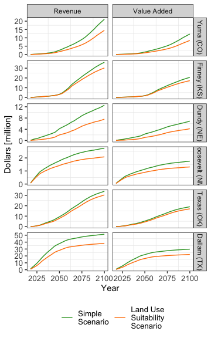

Goal: Make summary figure for economic projections (annual revenue and value added)

note: code by Sam Zipper


**R Packages Needed**


```r
library(tidyverse)
```

```
## Warning: package 'ggplot2' was built under R version 3.5.2
```

```
## Warning: package 'tibble' was built under R version 3.5.2
```

```
## Warning: package 'dplyr' was built under R version 3.5.2
```

```
## Warning: package 'stringr' was built under R version 3.5.2
```

```r
# directories: cleaned data from 00.23
library(here)
rootDir <- here::here()
subfolder <- 'data/tabular'
filename <- 'HPA_Transitions_Economic_Model-20190924.csv'

sessionInfo()
```

```
## R version 3.5.1 (2018-07-02)
## Platform: x86_64-apple-darwin15.6.0 (64-bit)
## Running under: macOS  10.14
## 
## Matrix products: default
## BLAS: /Library/Frameworks/R.framework/Versions/3.5/Resources/lib/libRblas.0.dylib
## LAPACK: /Library/Frameworks/R.framework/Versions/3.5/Resources/lib/libRlapack.dylib
## 
## locale:
## [1] en_US.UTF-8/en_US.UTF-8/en_US.UTF-8/C/en_US.UTF-8/en_US.UTF-8
## 
## attached base packages:
## [1] stats     graphics  grDevices utils     datasets  methods   base     
## 
## other attached packages:
##  [1] here_0.1        forcats_0.3.0   stringr_1.4.0   dplyr_0.8.0.1  
##  [5] purrr_0.2.5     readr_1.1.1     tidyr_0.8.1     tibble_2.0.1   
##  [9] ggplot2_3.2.0   tidyverse_1.2.1 knitr_1.20     
## 
## loaded via a namespace (and not attached):
##  [1] Rcpp_1.0.0       cellranger_1.1.0 pillar_1.3.1     compiler_3.5.1  
##  [5] tools_3.5.1      digest_0.6.16    lubridate_1.7.4  jsonlite_1.6    
##  [9] evaluate_0.11    nlme_3.1-137     gtable_0.2.0     lattice_0.20-35 
## [13] pkgconfig_2.0.2  rlang_0.3.1      cli_1.0.1        rstudioapi_0.7  
## [17] yaml_2.2.0       haven_1.1.2      withr_2.1.2      xml2_1.2.0      
## [21] httr_1.3.1       generics_0.0.2   hms_0.4.2        rprojroot_1.3-2 
## [25] grid_3.5.1       tidyselect_0.2.5 glue_1.3.0       R6_2.2.2        
## [29] readxl_1.1.0     rmarkdown_1.10   modelr_0.1.2     magrittr_1.5    
## [33] backports_1.1.2  scales_1.0.0     htmltools_0.3.6  rvest_0.3.2     
## [37] assertthat_0.2.0 colorspace_1.3-2 stringi_1.2.4    lazyeval_0.2.1  
## [41] munsell_0.5.0    broom_0.5.2      crayon_1.3.4
```

# load summary table 
and make figure


```r
df <- read_csv(paste0(rootDir, '/', subfolder, '/', filename))
```

```
## Parsed with column specification:
## cols(
##   state = col_character(),
##   Year = col_integer(),
##   revenue = col_double(),
##   valueAdded = col_double(),
##   scenario = col_integer()
## )
```

```r
df.long <- reshape2::melt(df, id = c("state", "Year", "scenario"))

p <- 
  ggplot(df.long, aes(x = Year, y = value/1e6, color = factor(scenario))) +
  geom_line() +
  scale_x_continuous(name = "Year", breaks = seq(2025, 2100, 25)) +
  scale_y_continuous(name = "Dollars [million]") +
  scale_color_manual(name = "Scenario", values = c("1" = "#33a02c", "2" = "#ff7f00"),
                     labels = c("1" = "Simple\nScenario", "2" = "Land Use\nSuitability\nScenario")) +
  facet_grid(state ~ variable, scales = "free_y",
             labeller = as_labeller(c("revenue" = "Revenue", "valueAdded" = "Value Added",
                                      "TX" = "Dallam (TX)",
                                      "CO" = "Yuma (CO)",
                                      "NM" = "Roosevelt (NM)",
                                      "KS" = "Finney (KS)",
                                      "NE" = "Dundy (NE)",
                                      "OK" = "Texas (OK)"))) +
  theme_bw() + 
  theme(legend.position = 'bottom',
              legend.title = element_blank(),
              axis.text=element_text(size=10),
              legend.text=element_text(size=10),
              axis.title=element_text(size=11),
              #panel.grid.minor = element_blank(),
              panel.grid.major = element_blank()) +
 ggsave(paste0(rootDir, '/figure/02.50_figs_summaryEcon/',"HPAecon_Timeseries.png"), width = 95, height = 190, units = "mm")
ggsave(paste0(rootDir, '/figure/02.50_figs_summaryEcon/',"HPAecon_Timeseries.pdf"), p, width = 95, height = 190, units = "mm", device = cairo_pdf)

p
```

<!-- -->

